# Wildfire Risk Prediction via Image Processing

This project implements a custom image processing pipeline to predict areas at risk of wildfires from satellite images. The focus is on preprocessing satellite images, texture detection, and vegetation analysis for automatic classification.

---

## Dataset

The project uses satellite images from the [Wildfire Prediction Dataset on Kaggle](https://www.kaggle.com/datasets/abdelghaniaaba/wildfire-prediction-dataset/data), which includes:

- **Classes:** `Wildfire` (areas where a wildfire occurred) and `No wildfire`.
- **Image format:** JPEG, 350x350 pixels.
- **Number of images:** ~22,710 wildfire and ~20,140 no wildfire images.
- **Example images:**

Image tag as `Wildfire`:

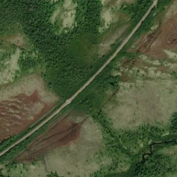

Image tag as `No wildfire`:

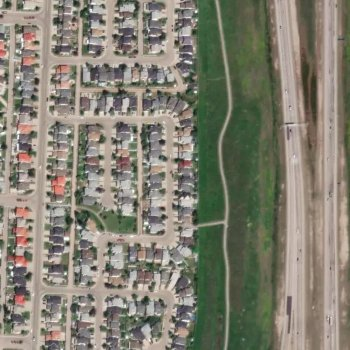

---
## Image Processing Model

This notebook demonstrates an image processing approach for predicting wildfire-prone areas. The workflow includes:

1. **Color space conversion:** Convert RGB images to HSV for better segmentation of vegetation.
2. **Contrast enhancement:** Histogram equalization of the Value channel to improve terrain visibility.
3. **Texture detection:** Apply Laplacian filter + binary masks to highlight areas with significant textures.
4. **Green mask & Green Leaf Index (GLI):** Identify regions dominated by vegetation.
5. **Contour filtering:** Filter relevant contours based on:
   - Minimum area
   - Aspect ratio
   - Fill ratio
   - Circularity
6. **Classification:** Images with significant contours are classified as `Wildfire`.

This approach demonstrates how classical image processing techniques can be applied for early wildfire detection using satellite imagery.

---

## Results

Using a test set, the image processing model achieved:

| Metric    | Value |
|-----------|-------|
| Accuracy  | 0.83  |
| Precision | 0.84  |
| Recall    | 0.85  |
| F1 Score  | 0.84  |

These results show that even without deep learning, image processing can provide meaningful wildfire risk predictions.

---

## Requirements

- Python 3.8+
- OpenCV (`opencv-python`)
- NumPy
- Matplotlib
- scikit-learn
- Seaborn
- Jupyter Notebook

## Usage

1. Clone this repository:

```bash
git clone https://github.com/YairJeri/WildFireDetection.git
cd WildFireDetection
``` 
2. Install the required packages:
```bash
pip install -r requirements.txt
```

## Process example

The following example demonstrates the image processing pipeline for predicting wildfire-prone areas.

### 0. Original image

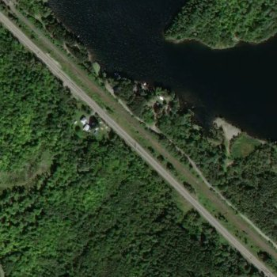

### 1. Color space conversion

Convert RGB images to HSV for better segmentation of vegetation and equalization of the Value channel to improve terrain visibility.

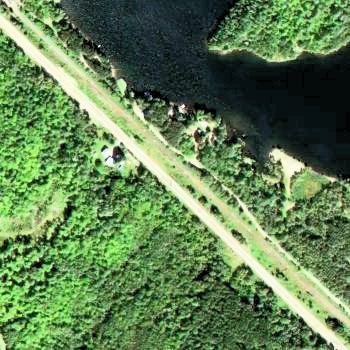

### 2. Texture detection

Apply Laplacian filter + binary masks to highlight areas with significant textures.

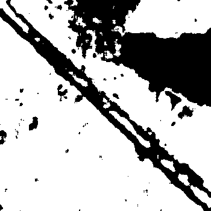

### 3. Green mask

Identify regions dominated by green color.

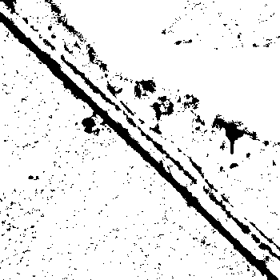

### 4. Green Leaf Index (GLI)

Calculate the Green Leaf Index (GLI) for each region.

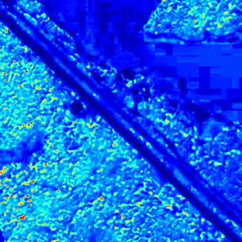

And create a mask upon certain threshold.

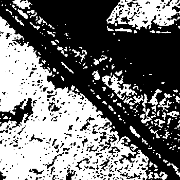

### 5. Combine masks and apply contour filtering

Combine the masks.

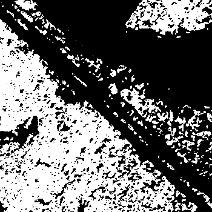

And apply contour filtering to identify areas with significant contours.

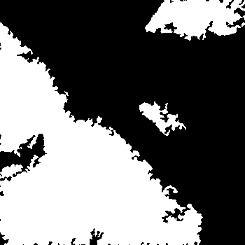

### 6. Classification

Classify the image as `Wildfire` if the final mask is non-zero.

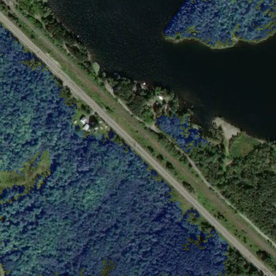

In this example, the image is classified as `Wildfire` due to the presence of significant contours.

## License

This project is licensed under the MIT License – see the [LICENSE](LICENSE) file for details.
